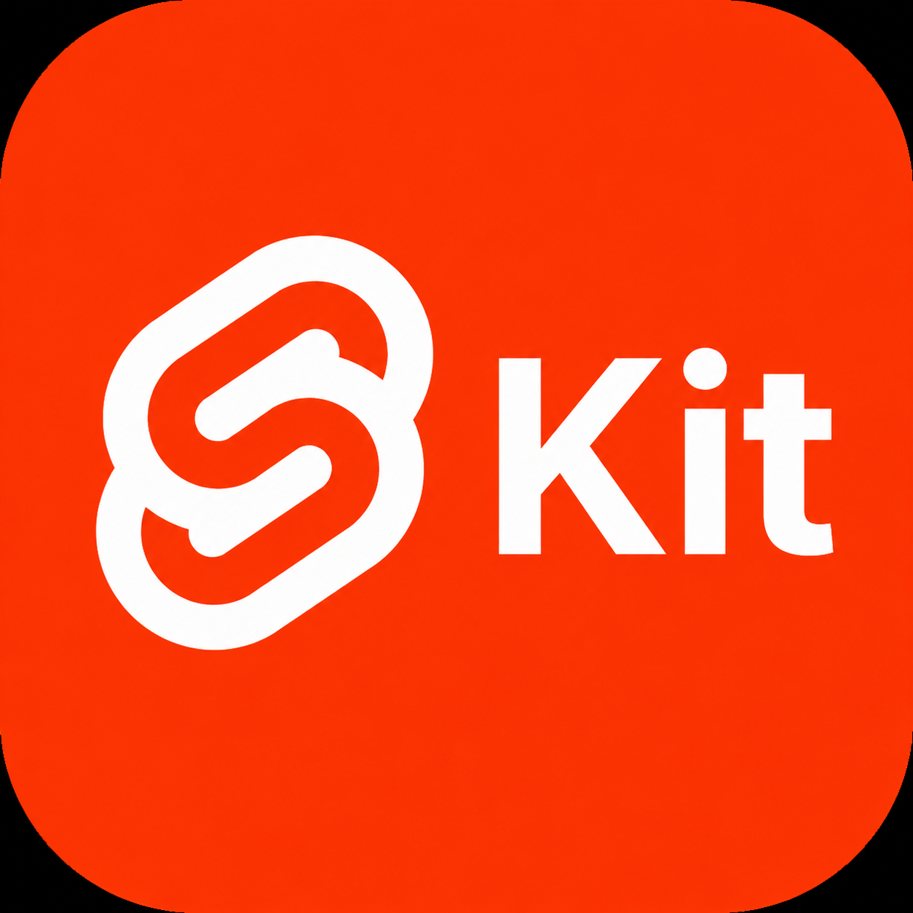
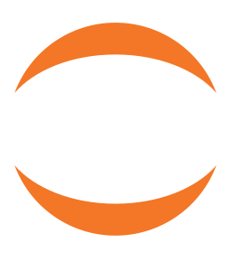

# Hi, I'm Mani Nageswar 👋

## 👤 About Me

I am a technology enthusiast with a strong interest in exploring and learning new technologies. Coming from an Electronics and Communication Engineering background, I built my software development journey through self-learning, with a focus on quickly adapting to new tools, frameworks, and problem domains.

I started my programming journey with Python and worked with Robot Framework before expanding into frontend development. Over time, I have developed hands-on knowledge of HTML, CSS, JavaScript, TypeScript, Bootstrap, Tailwind CSS, Angular, Svelte, and SvelteKit. Beyond web technologies, I have also explored blockchain fundamentals, earned a certification in the domain, and developed a growing interest in Rust, which I am currently learning at an intermediate level. I also actively embrace AI tools and workflows to improve productivity, learning, and day-to-day problem solving.

## 💻 Tech Skills

  
  
  
  
  
  
  
  
  
  
  
  
  
  
  
  
  
  
  
  
  
  
  
  
  
  
  
  
  
  
  
  
  
  
  
  
  
  
  
  
  
  
  

<!-- ### Programming Languages

  

### Frontend

  

### Backend

  

### Databases

  
  

### Testing and Automation

  

### Tools and Platforms

  
  
  

 -->

## 🚀 Projects

### [PG Finder](https://github.com/maninageswar/pg-finder)

A digital platform designed to simplify the process of finding and managing Paying Guest (PG) accommodations. It helps users discover comfortable and affordable stays while enabling PG owners to efficiently list and manage their properties.

### [Tic Tac Toe Game](https://github.com/maninageswar/tic-tac-toe-in-svelte)

A simple interactive Tic Tac Toe game built with Svelte, focused on clean UI, and core game logic implementation.

### [CRUD Operations in SvelteKit](https://github.com/maninageswar/crud-operations-sveltekit)

A SvelteKit-based project demonstrating create, read, update, and delete operations, highlighting practical understanding of application flow, data handling, and modern full-stack frontend development patterns.

<!-- ## 🎓 Education -->

<!-- Add your education details here -->

<!-- ## 💼 Experience -->

<!-- Add your work experience here -->

<!-- ## 🏆 Certifications -->

<!-- Add your certifications here -->

## 🔥 Contribution Streak

  

## 📫 Contact Information

- Email: maninageswarv@gmail.com
- LinkedIn: [mani-nageswar](https://www.linkedin.com/in/mani-nageswar-28a49b19b/)
